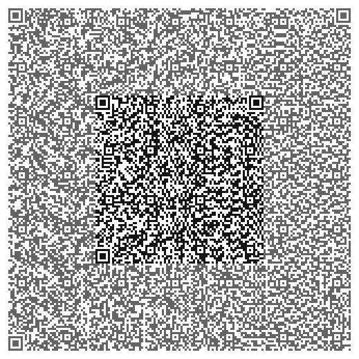

## Matryoshka QR codes

QR codes can be nested into 3 layers, like Russian Matryoshka dolls:

1. Create a unicode QR code (The following is not an image but text, mark some lines to see the difference):
```
▗▄▄▄░▖░▄░▗▄▄▄
▐▗▄▐░█▖▐▄▐▗▄▐
▐▐█▐▐▘▛▌▐▐▐█▐
▐▄▄▟▗▐▐▜▗▐▄▄▟
▗▖░▄▖░▜▄▞░▗▖░
░▀▛▄▝▞▚▀▙▚▛▀▄
░▜▖▄▄▟▄▝▗▚▌▌▞
▐▜▀▗▞░▘▙▛▗▌▗▄
▐▗▞▗▞▄▗▟▐█▄█▟
▗▄▄▄▐▙▙▞▐▗▐▀▜
▐▗▄▐▝▖▀▄█▄▟▙▐
▐▐█▐░▞▘▀▀▛▖▚▗
▐▄▄▟▐▜▄░▐▞▛▌▐
```
Created using: 
```
   ./crypto_puzzles.py -T R "Thecookiesarehiddenintheredbowl!"
```

2. Because it's text, it can be put into another QR, this time a PNG image:


Created using: 
```
./crypto_puzzles.py -T Rq "Thecookiesarehiddenintheredbowl!"
```

3. The QR code 2 can be put graphically into the middle of a third QR code:



All 3 steps are done using this command:
```
./crypto_puzzles.py -T RQ --grade 2 "Thecookiesarehiddenintheredbowl!"
```
